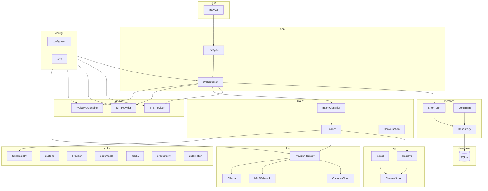

# Diagrama de módulos

## Dependencias permitidas

- `app` → todos los protocolos
- `skills` → `automation`, `vision`, `rag` (no al revés)
- `llm` → no importa `gui`
- `database` → no importa `audio`

## Mapa brief → módulo

| Capacidad del brief | Módulo |
|---------------------|--------|
| Hey Jarvis | `audio/wake` |
| Whisper | `audio/stt` |
| Voz natural | `audio/tts` |
| GPT/Claude/Ollama… | `llm/` |
| Memoria | `memory/` + `database/` |
| Abrir programas/web | `skills/system`, `skills/browser` |
| PDFs/Office/OCR | `skills/documents`, `vision/` |
| Spotify/YouTube | `skills/media` |
| Mouse/teclado/Windows | `automation/` |
| RAG | `rag/` |
| GUI | `gui/` |